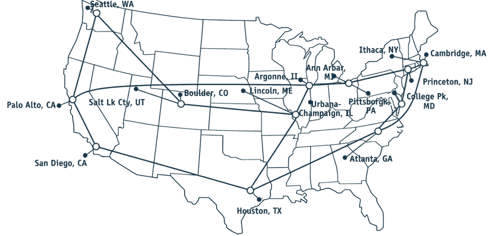

# Computer Networks

---

Learning Outcome: Students explain that information shared over connected computer networks must be protected from unauthorized access.

---

K-2.NI.1: Explain what passwords are, why they are used, and why it is important to develop strong passwords to protect devices and information

---

## Internet

- Set of globally networked computers
- Made of smaller networks
- Provides low-level communication between devices

---

## World Wide Web

- Enables content sharing over the Internet
- User-friendly and simple compared to earlier approaches

## Local Network

- Provides access to local shared resources
- Usually provides access the broader Internet via a router

---

{height=540px}
