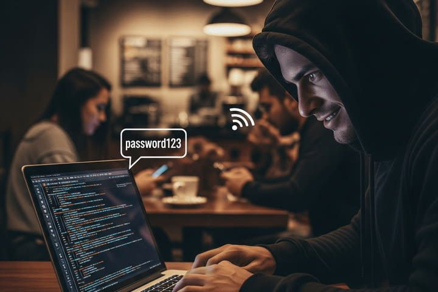

# Computer Networks

---

Learning Outcome: Students explain that information shared over connected computer networks must be protected from unauthorized access.

---

K-2.NI.1: Explain what passwords are, why they are used, and why it is important to develop strong passwords to protect devices and information

---

## Internet

- Set of globally networked computers
- Made of smaller networks
- Provides low-level communication between devices

---

## World Wide Web

- Enables content sharing over the Internet
- User-friendly and simple compared to earlier approaches

## Local Network

- Provides access to local shared resources
- Usually provides access the broader Internet via a router

---

{height=540px}

Eavesdropping
-------------

- Signal sent over radio frequency can be monitored by anyone
- Data sent of cable can be intercepted

---

<!-- Gemini 2.5: A photo of a cyberattacker stealing private information by eavesdropping on coffee shop WiFi. -->

Encryption
----------

- A mathematical technique to protect information
- Only intended parties are able to access encrypted information

HTTPS
-----

- Provides encryption for web traffic
- Indicated in browser when access secure sites

---

{height=540px}

Access
------

- Authentication is proving who you are 
  - Knowing a password
- Authorization is what you are allowed to do
  - Reading a doc vs editing it

Passwords
---------

- Used a one mechanism of authentication
- Must be kept secret
- Must be difficult to guess

---

{height=540px}

Password Cracking
-----------------

- Software can automate the process of password cracking
- May be able to try billions of passwords per second
- Common or reused passwords will be easily guessed

Password Policies
-----------------

- You will be required to follow password policies of your organization
- Select passwords that are uncommon and difficult to guess

Second Factor
-------------

- Many organizations will require two-factor authentication
- You may need a code or app from your phone to login
- This protects systems when passwords are stolen

Exercise
--------

Which password would you expect to be the strongest?

    A. password
    B. 123456
    C. AndersonUniversity1!
    D. HSrH@2jz
    E. TypeRentMultiplicationFierce
