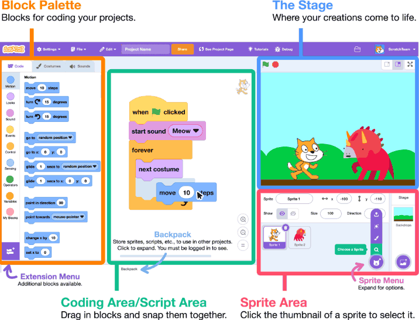
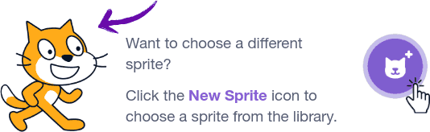
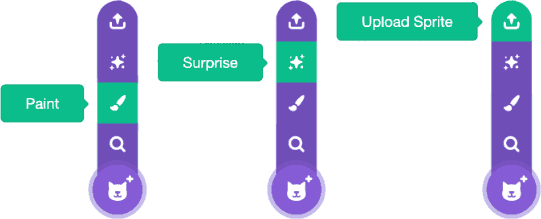
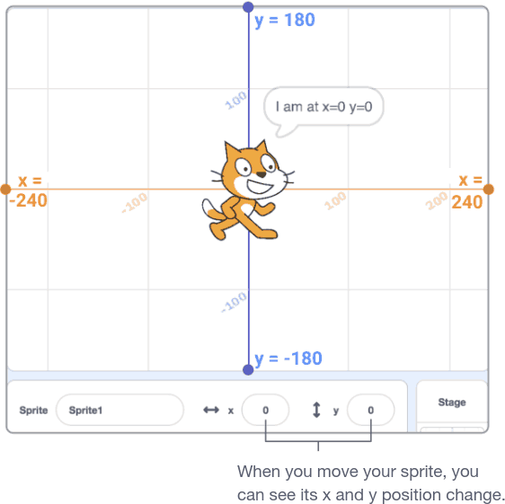
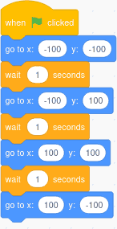

## Sprites

- In Scratch, any character or object is called a sprite
- Every new project in Scratch starts with the Cat sprite

---

---

## Sprite Position

- Every sprite has an x and y position on the Stage
- x is the position of the sprite from left-to-right
- y is the position from top-to-bottom
- At the very center of the stage, x is 0 and y is 0

---

## Tips

- Add temporary waits to observe behavior
- Observe how re-ordering blocks changes behavior
- Explore available blocks
- Click the bug for debugging tips

## Getting Started

- Many Scratch projects are started when the
user clicks the green flag
- The block to activate a code sequence when this occurs is in the `Events` category

## Scratch Blocks

- Blocks are the building blocks of our programs
- We arrange them like puzzle pieces
- Each block has a specific job or action

## Exercise

Create a Scratch program to move the cat to the four corners of the stage in sequence

---

---

What kind of actions might you want a character in a story to do?

## Block Types

- Motion: make sprites move, forward, turn, or jump
- Looks: change sprite appearance, say something, or change size
- Events: start code, trigger when things happen

## Exercise

Adjust your program to include two characters that can move and talk to each other
