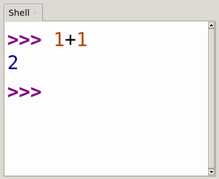

Literals
--------

- Basic components of expressions
- Evaluation yields on object of a given type

Binary Arithmetic Operators
---------------------------

- `+` Addition
- `-` Subtraction
- `*` Multiplication
- `/` Division

Arithmetic Examples
-------------------

```python
>>> 3.4 + 1.1
4.5
>>> 4 - 3
1
>>> 6 * 3
18
>>> 12 / 4
3.0
```

Value
-----

- Result object yielded by an expression
- Has a type such as integer or string of characters
- Examples:
  - `"Hello, World!"` (string)
  - `7` (integer)

Types
-----

- Set of allowed values for an object
- Built-in examples include numbers and strings

Numbers
-------

- Numeric values

```python
2, 3.4, -1, 0
```

Strings
-------

- An ordered collection of characters
- Delineated by single or double quotes

```python
"Hello, world!", "1", ""
```

Order of Operations
-------------------

Follows conventions from algebra

1. Parenthetic subexpressions
2. Exponentiation
3. Multiplication and division
4. Addition and subtraction

Examples
--------

```python
>>> 2 * 3 + 1
7
>>> 1 + 4 / 2
3.0
>>> 2 * (3 + 1)
8
```

Comparison Operations
---------------------

- Always return `True` or `False`

| Operator | Name |
|----------|------|
| `<` | Less than |
| `>` | Greater than |
| `<=` |  Less than or equal |
| `>=` | Greater than or equal |
| `==` | Equal |
| `!=` | Not equal |

Examples
--------

```python
>>> 2 < 3
True
>>> 2 <= 3
True
>>> 2 == 3
False
>>> 2 != 3
True
```

Logical Operations
------------------

- Always return `True` or `False` when operating on `True` and `False` values
- Examples include:
  - `not`
  - `and`
  - `or`

And Truth Table
---------------

 A | B | Q
---|---|---
 F | F | F
 F | T | F
 T | F | F
 T | T | T

Or Truth Table
--------------

 A | B | Q
---|---|---
 F | F | F
 F | T | T
 T | F | T
 T | T | T

Examples
--------

```python
>>> True and True
True
>>> True and False
False
>>> True or False
True
>>> False or False
False
```

---

What is the truth table for the following expression?

```python
not ((not A) and (not B))
```

Order of Operations
-------------------

Follows conventions from algebra

1. Parenthetic subexpressions
2. Exponentiation
3. Multiplication and division
4. Addition and subtraction
5. Comparison
6. Logical operations

Official Documentation
----------------------

[Expressions in Python](https://docs.python.org/3/reference/expressions.html)
